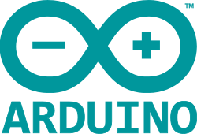
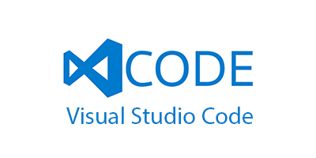
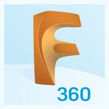
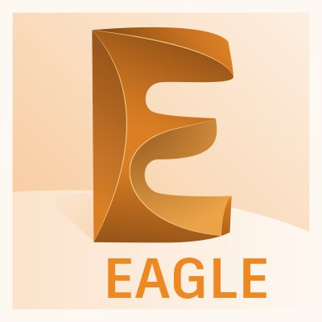

# ROBOBOS o UP-Robotics
### Un repositorio privado para el proyecto de UP-Robitcs. 
#### En este repositorio se va a guardar todo lo relacionado a UP-ROBOTICS como archivos de diseño 3D, Código de arduino o Raspberry y los diseños de circuitos o diagramas eléctronicos de EAGLE.
# Software necesario
#### PARA PROGRAMAR 
##### ARDUINO IDE :

#### VISUAL STUDIO CODE

#### PARA DISEÑO 3D 
##### FUSION 360:

#### PARA DISEÑO DE CIRCUITOS
##### EAGLE

# 
### SE ACTUALIZARÁ EL REPOSITORIO CONSTANTEMENTE 
